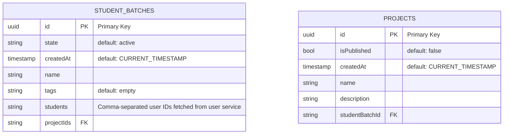

#  PAMP project service

## About the app

    This API allows the creation and management of student batches (fr: promotions)

## Installing the app
    Run cp .env.exemple  .env and modify it
    Run docker-compose up --build

    The app is accessible at localhost:3000/

### Database Entities:

### Authors :
    - Loriane HILDERAL